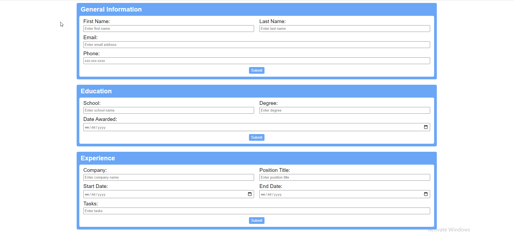

# CV-Application

## Description
A CV application project from TheOdinProject which allows a user to input information into forms and edit them. This project was created using ReactJS, create-react-app, and plain CSS. The purpose of this project was to reinforce my understanding of React states and props.

## 
